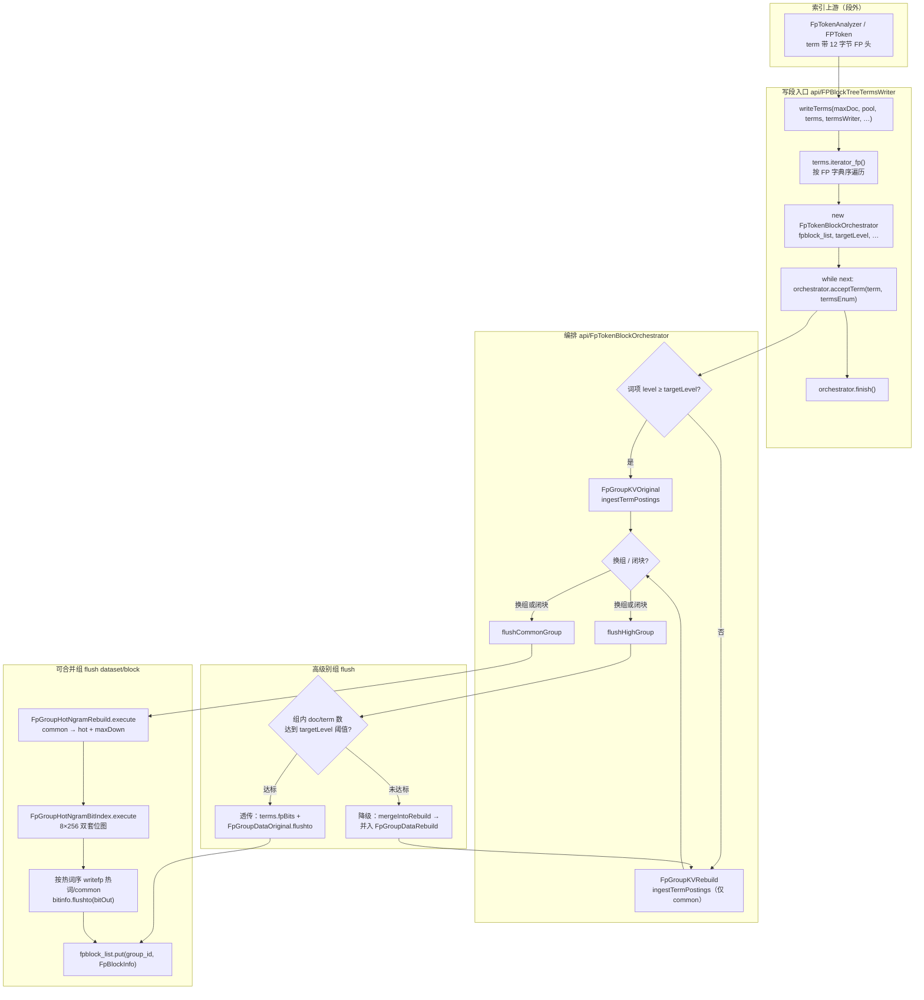
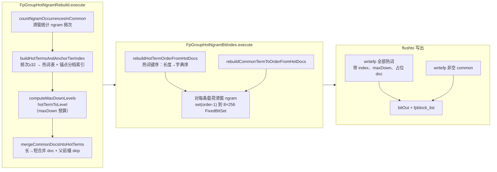

# FPToken（FP Token 模块）

面向 **LXDB / 补丁版 Lucene** 的二进制指纹（Fingerprint）索引：在 BlockTree 写段阶段按 **组（index_id + group_id）** 聚合词项，对 common 载荷做 **byte n-gram 热词挖掘** 与 **8×256 双套位图索引**，并支持高级别 term 的 **透传写出**（复用已有 `fpBits`）。

> 本仓库为 **2026-05 重写** 后的独立模块源码；须与完整 LXDB 工程（含补丁 Lucene）联编。设计说明见 [`docs/fp-token-design_20260517.html`](docs/fp-token-design_20260517.html)。

---

## 阅读导航

| 文档 | 说明 |
|------|------|
| [`docs/fp-token-design_20260517.html`](docs/fp-token-design_20260517.html) | 技术设计（类职责、数据流、落盘格式） |
| [`docs/fp-token-review-and-test-report_20260517.html`](docs/fp-token-review-and-test-report_20260517.html) | 代码审查 + 单元测试结果 + 潜在缺陷清单 |
| [`docs/README.md`](docs/README.md) | 历史/协作文档索引 |
| [`AGENTS.md`](AGENTS.md) | 贡献者与 Agent 速览 |

---

## 依赖

| 依赖 | 路径 / 说明 |
|------|-------------|
| **完整 `lib/`** | 与 Eclipse **`.classpath`** 对齐，约 **203** 个 JAR（`lxdb_common`、`lxdb_bigtable`、补丁 Lucene 8.9、slf4j/log4j、Tika/POI、JUnit 等）。从 LXDB 工程拷贝到 `lib/`；校验：`.\scripts\sync-lib-from-classpath.ps1` |
| **补丁 Lucene** | 由 `lib/` 提供：`Terms#iterator_fp()`、`Terms#fpBits`、`BlockTreeTermsWriter#writefp`、`TermsWriter` 等 |
| **JUnit** | `scripts/run-fptoken-tests.ps1` 可自动下载 JUnit Platform；另可自动拉取 `commons-logging-1.2.jar` |

在 **`lib/` 齐全** 时，脚本对 **全部** `src/cn` 执行 `javac` 并运行单测。若缺少补丁 JAR，脚本会回退到较小可编译子集（仅用于应急，见下文）。

---

## 包结构（`cn.lxdb.plugins.muqingyu.fptoken`）

```
token/          FPToken、FpTokenAnalyzer、BinarySlidingWindowApi（64B 窗 / 32B 步）
config/         FpTokenBlockLevelPolicy、Lucene80FPSearchConfig（字段后缀 _bfp / _sfp）
api/            FPBlockTreeTermsWriter、FpTokenBlockOrchestrator、FpFilteredTermsEnum
dataset/common/ FpTokenTermLayout、FpTermKey、FPDocList、FpBlockInfo、组 KV 容器
dataset/block/  FpGroupDataOriginal / Rebuild、FpGroupHotNgramRebuild、FpGroupHotNgramBitIndex
```

---

## 写段流程（入口：`FPBlockTreeTermsWriter`）

LXDB 补丁 Lucene 在写 FP 字段（`Lucene80FPSearchConfig.isFpField`：后缀 `_bfp` / `_sfp`）时，由 `BlockTreeTermsWriter` 构造 `FPBlockTreeTermsWriter`，共享 `bitOut`（n-gram 位图侧车）与 `fpblock_list`（每组 `FpBlockInfo`）。

### 总览



### 调用顺序与职责

| 顺序 | 调用 | 做什么 | 原理 |
|:--:|------|--------|------|
| 0 | （段外）`FpTokenAnalyzer` | 产出带 FP 头的 term 字节 | 头含 `index_id`、`group_id`、`level`、`hot/common` 标记等，供写段与检索共用布局（`FpTokenTermLayout`） |
| 1 | `FPBlockTreeTermsWriter.writeTerms` | 打开 FP 字段写段会话 | 持有 `bitOut`、`fpblock_list`；不直接写 Lucene 词项，委托编排器 |
| 2 | `Terms.iterator_fp()` | 按 FP 规则排序遍历全字段词项 | 补丁 Lucene：保证同 `(index_id, group_id)` 连续，便于组缓冲 |
| 3 | `FpTokenBlockOrchestrator` 构造 | 计算 `targetLevel` | `FpTokenBlockLevelPolicy.resolveTargetBlockLevel(maxDoc, guess_size)`：大段用大闭块阈值（level 3），否则 level 1 |
| 4 | `acceptTerm`（循环） | 按组缓冲 posting | **换组**时先 `flushHighGroup` / 必要时 `flushCommonGroup`；再按词项 `level` 分流 |
| 4a | `FpGroupDataOriginal.ingest` | 高级别路径：热词+common 原样累 doc | 保留 term 头里的 index、level、占位标记；组内 `distinctDocUnion` 用于闭块判定 |
| 4b | `FpGroupDataRebuild.ingest` | 可合并路径：**只** ingest common | 热词不在此阶段写入；`isHotTerm` 的 term 直接 return，避免与后续 n-gram 挖掘重复 |
| 5 | `tryFlushCommonIfComplete` | 组内 doc/term 达标则提前闭块 | `shouldCompleteBlock(3, targetLevel, …)`：十万级规模才强制凑满再 flush |
| 6 | `finish` | 刷掉最后一组 high + common | 保证段末无残留缓冲 |
| 7a | `flushHighGroup` → 透传 | `terms.fpBits` 取已有位图 + `FpGroupDataOriginal.flushto` | 组未因删除等「降级」时，**不重算** n-gram/热词，CPU 最优；`writefp` 写出 term + posting |
| 7b | `flushHighGroup` → 降级 | `mergeIntoRebuild` 并入当前/新建 `FpGroupDataRebuild` | 高级别组体量不足，与 common 组合并后走重建链路 |
| 8 | `flushCommonGroup` → `FpGroupDataRebuild.flushto` | 热词重建 + 位图 + 落盘 | 见下节分步 |
| 9 | `termsWriter.writefp` | 补丁 Lucene 写 FP term 与 doclist | 与标准 BlockTree 并行，payload 为 FP 布局 term |
| 10 | `FpGroupHotNgramBitIndex.flushto(bitOut)` | 序列化 8×256 banks | `FpBlockInfo` 记录偏移/宽度；写入 `fpblock_list[group_id]` |

### 可合并路径：`FpGroupDataRebuild.flushto` 内部分步



**热词重建要点**（`FpGroupHotNgramRebuild`）：

- 从 **common 载荷** 挖 byte n-gram（默认长度 1~6，阈值 32），生成扁平热词表（非树形存储）。
- `hotTermToLevel`：从锚点长度向下，**累加**各档子串规模；未超过阈值则 `maxDown++`，限制查询/写段向下遍历深度。
- merge 时 `markParentPrefixesSkippedInCommonTerm`：在 `extensionBytes ≤ maxDown` 时，同一 common 内不再向更短父热词重复 merge（空间换时间；深档不拼回时父 posting 仍保留 doc）。
- 热词 `TreeMap` 使用 `FpTermKey.ORDER_BY_LENGTH_THEN_BYTES`，编号、`writefp`、位图遍历顺序一致。

**位图索引要点**（`FpGroupHotNgramBitIndex`）：

- 热词、common **各一套** `NGRAM_MAX × 256` 的 `FixedBitSet`（1 字节 ngram 按字节分桶，多字节按哈希折叠到 0..255）。
- common 侧对已是热词整键的 ngram 切片 **跳过**，避免重复标记。
- 检索侧用 `FpBlockInfo` 偏移按需读 bank（见设计文档）。

### 高级别透传路径（对比）

| 项目 | `FpGroupDataOriginal` | `FpGroupDataRebuild` |
|------|------------------------|----------------------|
| 触发 | 词项 `level ≥ targetLevel` 且组闭块时体量达标 | 低级别词项 + 降级合并组 |
| ingest | 热词 + common 带头入库 | 仅 common |
| 热词来源 | 索引阶段已有 | flush 时 n-gram 挖掘 |
| 位图 | `terms.fpBits(index_id, group_id, …)` 复用 | `FpGroupHotNgramBitIndex.execute` 新建 |
| maxDown | 从原 term 头读取 | `computeMaxDownLevels` 计算 |

### 上游与检索（本 README 不展开）

- **上游**：`token/FpTokenAnalyzer`、`FPToken` 生成 FP 载荷与组号。
- **检索**：补丁 `Terms` / `FpFilteredTermsEnum` 读 `fpBits` 与 `writefp` 写出的 term；按 `maxDown` 向下拼子档（查询模块在 LXDB 侧）。

更细的落盘字节布局见 [`docs/fp-token-design_20260517.html`](docs/fp-token-design_20260517.html)。

---

## 构建与测试

**推荐脚本**（仓库根目录）：

```powershell
.\scripts\run-fptoken-tests.ps1 -HtmlReport -ExcludePerfTag
```

| 场景 | 命令 |
|------|------|
| 默认单元测试（排除 `lxdb-runtime`、`performance`） | 上式或 `.\scripts\run-fptoken-tests.ps1` |
| 含依赖完整 LXDB 运行时的用例 | `.\scripts\run-fptoken-tests.ps1 -IncludeLxdbRuntimeTag`（须在完整 classpath 下） |
| 已用 IDE 与 LXDB 全量编译 | `.\scripts\run-fptoken-tests.ps1 -SkipCompile` |

**报告目录**（可删除）：`build/test-results/junit-html/index.html`

**编译说明**：

1. 运行 classpath：`bin` → `bin-test` → `lib/*.jar`。
2. 默认尝试编译全部 `src/cn`（需完整 `lib/`）。
3. 若失败，回退编译子集（`token/` 部分类 + `dataset/common` 等）；完整模块仍应在 LXDB IDE 或补齐 `lib/` 后编译。

**测试包**：`src/test/java/cn/lxdb/plugins/muqingyu/fptoken/tests/unit/`

---

## 与旧版 fptoken（互斥频繁项集 / Pre-merge hint）的关系

本仓库 **已不再包含** 旧版 `ExclusiveFpRowsProcessingApi`、采样挖掘、Pre-merge hint 等实现；相关文档若仍出现在 `docs/` 下，仅作历史参考。新模块解决的是 **Lucene 段内 FP 字段的写段编排与 n-gram 位图**，与「行级互斥项集三层输出」是不同层次的能力，可在 LXDB 产品内组合使用。

---

## 已知问题（摘要）

完整列表与测试证据见 [`docs/fp-token-review-and-test-report_20260517.html`](docs/fp-token-review-and-test-report_20260517.html)。摘要：

- **P0 / P1**：无开放项（审查中的逻辑/行为点均已按产品约定撤回，见报告 §4）。
- **P2（可选）**：块级别策略注释、Javadoc/类名一致性与集成测覆盖（BUG-201～204）。

---

## 许可与归属

模块作者见各源文件 `@author`；与 LXDB/Lucene 补丁的版权与分发策略以宿主工程为准。
