# FPToken（FP Token 模块）

面向 **LXDB / 补丁版 Lucene** 的二进制指纹（Fingerprint）索引：在 BlockTree 写段阶段按 **组（index_id + group_id）** 聚合词项，对 common 载荷做 **byte n-gram 热词挖掘** 与 **8×256 双套位图索引**，并支持高级别 term 的 **透传写出**（复用已有 `fpBits`）。

> 本仓库为 **2026-05 重写** 后的独立模块源码；须与完整 LXDB 工程（含补丁 Lucene）联编。设计说明见 [`docs/fp-token-design_20260517.html`](docs/fp-token-design_20260517.html)。

---

## 阅读导航

| 文档 | 说明 |
|------|------|
| [写段详细流程图 PNG](docs/fp-token-write-path-detailed.png) | **高分辨率整图（约 4324×16694）· 源文件 `docs/fp-token-write-path-detailed.mmd`** |
| [浏览器查看](docs/fp-token-write-path-detailed.html) | 同上，HTML 页内可缩放滚动 |
| [本 README § 写段总流程图](#写段总流程图入口fpblocktreetermswriter) | 简版 Mermaid（嵌入 README） |
| [`docs/fp-token-design_20260517.html`](docs/fp-token-design_20260517.html) | 技术设计（类职责、数据流、落盘格式） |
| [`docs/fp-token-review-and-test-report_20260517.html`](docs/fp-token-review-and-test-report_20260517.html) | 代码审查 + 单元测试结果 + 潜在缺陷清单 |
| [`docs/README.md`](docs/README.md) | 历史/协作文档索引 |
| [`AGENTS.md`](AGENTS.md) | 贡献者与 Agent 速览 |

---

## 依赖

| 依赖 | 路径 / 说明 |
|------|-------------|
| **完整 `lib/`** | 与 Eclipse **`.classpath`** 对齐，约 **203** 个 JAR（`lxdb_common`、`lxdb_bigtable`、补丁 Lucene 8.9、slf4j/log4j、Tika/POI、JUnit 等）。从 LXDB 工程拷贝到 `lib/`；校验：`.\scripts\sync-lib-from-classpath.ps1` |
| **补丁 Lucene** | 由 `lib/` 提供：`Terms#iterator_fp()`、`Terms#fpBits`、`BlockTreeTermsWriter#writefp`、`TermsWriter` 等 |
| **JUnit** | `scripts/run-fptoken-tests.ps1` 可自动下载 JUnit Platform；另可自动拉取 `commons-logging-1.2.jar` |

在 **`lib/` 齐全** 时，脚本对 **全部** `src/cn` 执行 `javac` 并运行单测。若缺少补丁 JAR，脚本会回退到较小可编译子集（仅用于应急，见下文）。

---

## 包结构（`cn.lxdb.plugins.muqingyu.fptoken`）

```
token/          FPToken、FpTokenAnalyzer、BinarySlidingWindowApi（64B 窗 / 32B 步）
config/         FpTokenBlockLevelPolicy、Lucene80FPSearchConfig（字段后缀 _bfp / _sfp）
api/            FPBlockTreeTermsWriter、FpTokenBlockOrchestrator、FpFilteredTermsEnum
dataset/common/ FpTokenTermLayout、FpTermKey、FPDocList、FpBlockInfo、组 KV 容器
dataset/block/  FpGroupDataOriginal / Rebuild、FpGroupHotNgramRebuild、FpGroupHotNgramBitIndex
```

---

## 写段总流程图（入口：`FPBlockTreeTermsWriter`）

**详细高清整图（推荐）**：[docs/fp-token-write-path-detailed.png](docs/fp-token-write-path-detailed.png)（可用 [docs/fp-token-write-path-detailed.html](docs/fp-token-write-path-detailed.html) 打开）。源图 `docs/fp-token-write-path-detailed.mmd`，重新生成：`.\scripts\render-fp-write-path-diagram.ps1`。

下面为 README 内嵌的简版 Mermaid。字段后缀 `_bfp` / `_sfp`。字节格式见 [`docs/fp-token-design_20260517.html`](docs/fp-token-design_20260517.html)。

```mermaid
flowchart TD
  subgraph P0["【阶段0】索引上游 token/ · 写段前完成"]
    P0A["FpTokenAnalyzer → FPToken<br/>文本切成指纹字节"]
    P0B["每个 term = 13字节头 + 载荷<br/>头里已有：组号、级别、是否热词…"]
    P0A --> P0B
  end

  subgraph P1["【阶段1】补丁 Lucene 调本模块"]
    P1A["BlockTreeTermsWriter 要写 FP 字段"]
    P1B["new FPBlockTreeTermsWriter<br/>绑定 bitOut 侧车 + fpblock_list"]
    P1A --> P1B
  end
  P0 --> P1

  subgraph P2["【阶段2】FPBlockTreeTermsWriter.writeTerms · 写段总入口"]
    P2A["iterator_fp 遍历全字段词项<br/>同一 index_id+group_id 必须挨着"]
    P2B["new FpTokenBlockOrchestrator"]
    P2C["FpTokenBlockLevelPolicy<br/>段很大→闭块用3级，否则用1级"]
    P2A --> P2B --> P2C
  end
  P1 --> P2

  subgraph P2H["词项结构 FpTokenTermLayout"]
    direction LR
    H1["0-1 索引号"] --> H2["2-5 组号"] --> H3["6 级别"]
    H3 --> H4["7 热词/普通"] --> H5["8-11 编号"] --> H6["12 maxDown"]
    H6 --> H7["13+ 字节载荷"]
  end
  P2 --> P2H

  subgraph P3["【阶段3】循环 acceptTerm · 每个词项一次"]
    P3A{"换组了？"}
    P3A -->|是| P3B["flushHighGroup 先结旧的高级组"]
    P3B --> P3C{"换组且 common 组够大？"}
    P3C -->|是| P3C2["flushCommonGroup"]
    P3A -->|否| P3D
    P3C -->|否| P3D
    P3C2 --> P3D{"词项 level ≥ targetLevel？"}
    P3D -->|是| P3E["FpGroupDataOriginal.ingest<br/>热词+普通都进桶，保留原头"]
    P3D -->|否| P3F["FpGroupDataRebuild.ingest<br/>跳过热词，只攒 common 的 posting"]
    P3E --> P3G([下一个词项])
    P3F --> P3G
  end
  P2H --> P3
  P3G -->|全部读完| P4A

  subgraph P4["【阶段4】finish 刷掉最后一组"]
    P4A["flushHighGroup"]
    P4B["flushCommonGroup"]
    P4A --> P4B
  end

  subgraph P4H["flushHighGroup 分支说明"]
    PH1{"组够大？达标闭块"}
    PH1 -->|达标·透传| PH2["fpBits 复用旧位图<br/>Original.flushto 原样 writefp"]
    PH1 -->|不够·降级| PH4["mergeIntoRebuild 并进 Rebuild"]
    PH2 --> PH3["登记 FpBlockInfo"]
  end
  P4A -.-> P4H

  subgraph P5["【阶段5】flushCommon → Rebuild.flushto · 小组合并主路径"]
    P5A["FpGroupHotNgramRebuild.execute"]
    P5A1["① 统计 common 里各 ngram 在多少个 common 词中出现"]
    P5A2["② 出现≥32次→热词；建锚点分档索引 AnchorTierIndex"]
    P5A3["③ 算 maxDown 写入 hotTermToLevel<br/>控制查询向下拼几层，也控制写段 merge"]
    P5A4["④ 长→短把 common 的 doc 并入热词<br/>在 maxDown 内则本 common 内不再重复 merge 父词"]
    P5A --> P5A1 --> P5A2 --> P5A3 --> P5A4

    P5B["FpGroupHotNgramBitIndex.execute"]
    P5B1["热词/common 编号；热词按 长度→字典序"]
    P5B2["两套 6×256 位图；common 侧跳过已是热词的切片"]
    P5B --> P5B1 --> P5B2

    P5A4 --> P5B
    P5B2 --> P5C["writefp 热词+common"]
    P5C --> P5D["位图写入 bitOut，fpblock_list 记偏移"]
    P5D --> P5E["清空组缓冲 resetAfterFlush"]
  end
  P4B --> P5A
  PH4 -.->|降级| P5A

  subgraph CLS["涉及的类（按包）"]
    direction TB
    C1["api: FPBlockTreeTermsWriter · FpTokenBlockOrchestrator"]
    C2["config: Lucene80FPSearchConfig · FpTokenBlockLevelPolicy"]
    C3["common: FpTokenTermLayout · FpTermKey · FPDocList · FpBlockInfo"]
    C4["block: FpGroupDataOriginal/Rebuild · HotNgramRebuild · HotNgramBitIndex"]
    C1 --> C2 --> C3 --> C4
  end
  P5E --> CLS

  subgraph P6["【阶段6】落盘结果"]
    O1["倒排: writefp 的 term+posting"]
    O2["bitOut: 每组 ngram 位图"]
    O3["fpblock_list: 查偏移"]
    O1 --> O2 --> O3
  end
  CLS --> P6

  subgraph P7["【阶段7】检索 LXDB 查询侧"]
    R1["读 term 头里 maxDown"]
    R2["FpBlockInfo 定位位图桶"]
    R3["按 maxDown 向下拼子档 posting"]
    R1 --> R2 --> R3
  end
  P6 --> P7
```



**怎么读这张图（从上到下）**

- **阶段0~1**：索引先把带 FP 头的词写好；Lucene 写段时创建 `FPBlockTreeTermsWriter`。
- **阶段2**：`writeTerms` 里创建编排器，算本段用几级闭块阈值（`targetLevel`）。
- **阶段3**：每个词项 `acceptTerm`——换组就先刷旧组；高级别词进 `FpGroupDataOriginal`，低级词只把 common 的 posting 攒起来。
- **阶段4~flushHigh**：大组够大就**透传**（不重挖热词、复用位图）；不够就**降级**进下面重建路径。
- **阶段5**：从 common **现挖热词**（≥32）、算 **maxDown**、合并 doc、建 **8×256 位图**，再 **writefp**。
- **阶段6~7**：倒排 + 位图侧车 + 元数据；查询按 maxDown 和位图拼档。

---

## 构建与测试

**推荐脚本**（仓库根目录）：

```powershell
.\scripts\run-fptoken-tests.ps1 -HtmlReport -ExcludePerfTag
```

| 场景 | 命令 |
|------|------|
| 默认单元测试（排除 `lxdb-runtime`、`performance`） | 上式或 `.\scripts\run-fptoken-tests.ps1` |
| 含依赖完整 LXDB 运行时的用例 | `.\scripts\run-fptoken-tests.ps1 -IncludeLxdbRuntimeTag`（须在完整 classpath 下） |
| 已用 IDE 与 LXDB 全量编译 | `.\scripts\run-fptoken-tests.ps1 -SkipCompile` |

**报告目录**（可删除）：`build/test-results/junit-html/index.html`

**编译说明**：

1. 运行 classpath：`bin` → `bin-test` → `lib/*.jar`。
2. 默认尝试编译全部 `src/cn`（需完整 `lib/`）。
3. 若失败，回退编译子集（`token/` 部分类 + `dataset/common` 等）；完整模块仍应在 LXDB IDE 或补齐 `lib/` 后编译。

**测试包**：`src/test/java/cn/lxdb/plugins/muqingyu/fptoken/tests/unit/`

---

## 与旧版 fptoken（互斥频繁项集 / Pre-merge hint）的关系

本仓库 **已不再包含** 旧版 `ExclusiveFpRowsProcessingApi`、采样挖掘、Pre-merge hint 等实现；相关文档若仍出现在 `docs/` 下，仅作历史参考。新模块解决的是 **Lucene 段内 FP 字段的写段编排与 n-gram 位图**，与「行级互斥项集三层输出」是不同层次的能力，可在 LXDB 产品内组合使用。

---

## 已知问题（摘要）

完整列表与测试证据见 [`docs/fp-token-review-and-test-report_20260517.html`](docs/fp-token-review-and-test-report_20260517.html)。摘要：

- **P0 / P1**：无开放项（审查中的逻辑/行为点均已按产品约定撤回，见报告 §4）。
- **P2（可选）**：块级别策略注释、Javadoc/类名一致性与集成测覆盖（BUG-201～204）。

---

## 许可与归属

模块作者见各源文件 `@author`；与 LXDB/Lucene 补丁的版权与分发策略以宿主工程为准。
