# FPToken（FP Token 模块）

面向 **LXDB / 补丁版 Lucene** 的二进制指纹（Fingerprint）索引：在 BlockTree 写段阶段按 **组（index_id + group_id）** 聚合词项，对 common 载荷做 **byte n-gram 热词挖掘** 与 **8×256 双套位图索引**，并支持高级别 term 的 **透传写出**（复用已有 `fpBits`）。

> 本仓库为 **2026-05 重写** 后的独立模块源码；须与完整 LXDB 工程（含补丁 Lucene）联编。设计说明见 [`docs/fp-token-design_20260517.html`](docs/fp-token-design_20260517.html)。

---

## 阅读导航

| 文档 | 说明 |
|------|------|
| [本 README § 写段架构与调用详解](#写段架构与调用详解入口fpblocktreetermswriter) | **从 `FPBlockTreeTermsWriter` 起的 Mermaid 流程图 / 调用树 / 类职责图** |
| [`docs/fp-token-design_20260517.html`](docs/fp-token-design_20260517.html) | 技术设计（类职责、数据流、落盘格式） |
| [`docs/fp-token-review-and-test-report_20260517.html`](docs/fp-token-review-and-test-report_20260517.html) | 代码审查 + 单元测试结果 + 潜在缺陷清单 |
| [`docs/README.md`](docs/README.md) | 历史/协作文档索引 |
| [`AGENTS.md`](AGENTS.md) | 贡献者与 Agent 速览 |

---

## 依赖

| 依赖 | 路径 / 说明 |
|------|-------------|
| **完整 `lib/`** | 与 Eclipse **`.classpath`** 对齐，约 **203** 个 JAR（`lxdb_common`、`lxdb_bigtable`、补丁 Lucene 8.9、slf4j/log4j、Tika/POI、JUnit 等）。从 LXDB 工程拷贝到 `lib/`；校验：`.\scripts\sync-lib-from-classpath.ps1` |
| **补丁 Lucene** | 由 `lib/` 提供：`Terms#iterator_fp()`、`Terms#fpBits`、`BlockTreeTermsWriter#writefp`、`TermsWriter` 等 |
| **JUnit** | `scripts/run-fptoken-tests.ps1` 可自动下载 JUnit Platform；另可自动拉取 `commons-logging-1.2.jar` |

在 **`lib/` 齐全** 时，脚本对 **全部** `src/cn` 执行 `javac` 并运行单测。若缺少补丁 JAR，脚本会回退到较小可编译子集（仅用于应急，见下文）。

---

## 包结构（`cn.lxdb.plugins.muqingyu.fptoken`）

```
token/          FPToken、FpTokenAnalyzer、BinarySlidingWindowApi（64B 窗 / 32B 步）
config/         FpTokenBlockLevelPolicy、Lucene80FPSearchConfig（字段后缀 _bfp / _sfp）
api/            FPBlockTreeTermsWriter、FpTokenBlockOrchestrator、FpFilteredTermsEnum
dataset/common/ FpTokenTermLayout、FpTermKey、FPDocList、FpBlockInfo、组 KV 容器
dataset/block/  FpGroupDataOriginal / Rebuild、FpGroupHotNgramRebuild、FpGroupHotNgramBitIndex
```

---

## 写段架构与调用详解（入口：`FPBlockTreeTermsWriter`）

本节以流程图说明写段全路径（入口 `api/FPBlockTreeTermsWriter`）。FP 字段：`Lucene80FPSearchConfig.isFpField`（`_bfp` / `_sfp`）。落盘细节见 [`docs/fp-token-design_20260517.html`](docs/fp-token-design_20260517.html)。

> 下图使用 Mermaid。请在支持 Mermaid 的预览中查看（VS Code、GitHub、GitLab 等）。

### 1. 与宿主 Lucene 的衔接

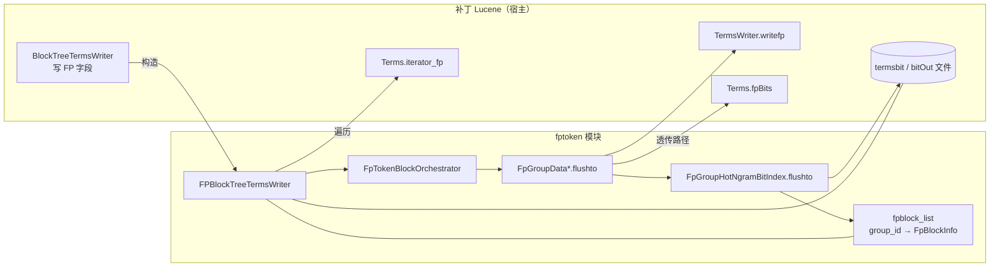

---

### 2. 类职责与依赖（按包）

```mermaid
flowchart TB
  subgraph TOK["token/ · 索引上游（不写段）"]
    direction TB
    T1[FpTokenAnalyzer<br/>Lucene Analyzer 入口]
    T2[FPToken<br/>滑窗 → 带 FP 头的 term]
    T3[FpTokenBytesMode · BinarySlidingWindowApi<br/>字节模式 / 64×32 滑窗]
    T1 --> T2
    T2 -.-> T3
  end

  subgraph CFG["config/"]
    C1[Lucene80FPSearchConfig<br/>isFpField · NGRAM 1~6 · 阈值32 · BUCKETS256]
    C2[FpTokenBlockLevelPolicy<br/>resolveTargetBlockLevel<br/>shouldCompleteBlock]
  end

  subgraph API["api/ · 写段入口"]
    A1[FPBlockTreeTermsWriter<br/>writeTerms · fpblock_list · bitOut]
    A2[FpTokenBlockOrchestrator<br/>acceptTerm · finish · flush*]
    A3[FpFilteredTermsEnum<br/>合并索引注入 index_id 前缀]
    A1 --> A2
  end

  subgraph COM["dataset/common/"]
    direction TB
    M1[FpTokenTermLayout<br/>13 字节头 + payload]
    M2[FpTermKey<br/>Map 键 · ORDER_BY_LENGTH_THEN_BYTES]
    M3[FPDocList<br/>doc 列表 int[] / BitSet]
    M4[FpBlockInfo<br/>位图区元数据]
    M5[FpGroupKVOriginal / FpGroupKVRebuild<br/>6 字节组号 + 组数据]
    M6[FpStat · FpStatNgram<br/>段级 / ngram 统计]
    M5 --> M1
    M5 --> M3
  end

  subgraph BLK["dataset/block/"]
    B1[FpGroupDataOriginal<br/>高级别缓冲 hot+common]
    B2[FpGroupDataRebuild<br/>可合并缓冲 仅 common]
    B3[FpGroupHotNgramRebuild<br/>common→hot · maxDown]
    B4[FpGroupHotNgramBitIndex<br/>8×256 双套位图]
    B5[AnchorTierIndex<br/>热词锚点分档索引]
    B2 --> B3 --> B4
    B3 -.-> B5
  end

  TOK -.->|产出 term| API
  CFG --> A2
  A2 --> M5
  A2 --> B1
  A2 --> B2
  B1 --> M4
  B2 --> M4
  A3 -.->|检索侧| M1
```

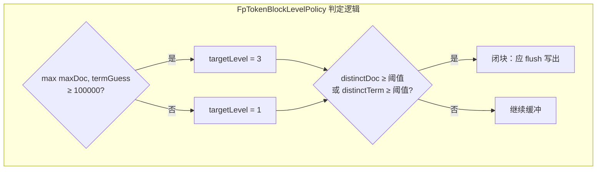

---

### 3. FP 词项字节布局（`FpTokenTermLayout`）

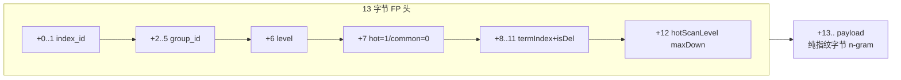

---

### 4. 主调用树流程图（`writeTerms` 全展开）

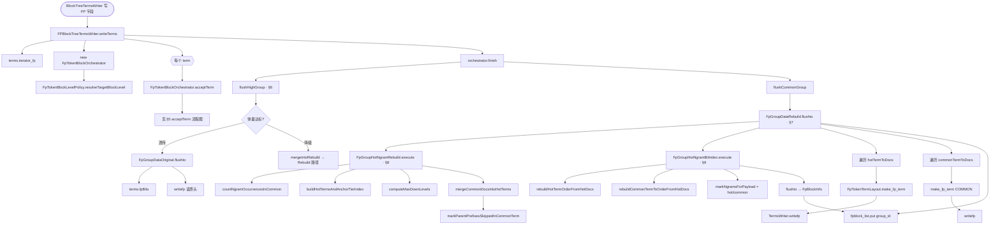

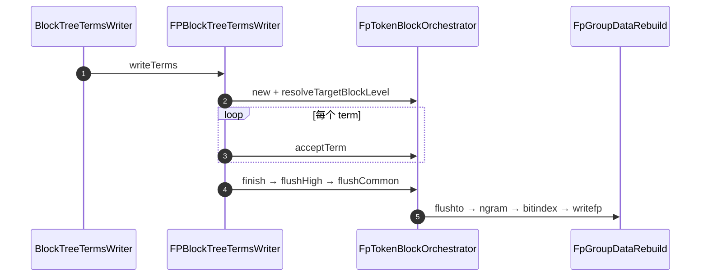

---

### 5. `acceptTerm` 流程图（组缓冲 + 分流）

`iterator_fp` 保证同 `(index_id, group_id)` 连续；`indexAndGroupEquals` 检测换组。

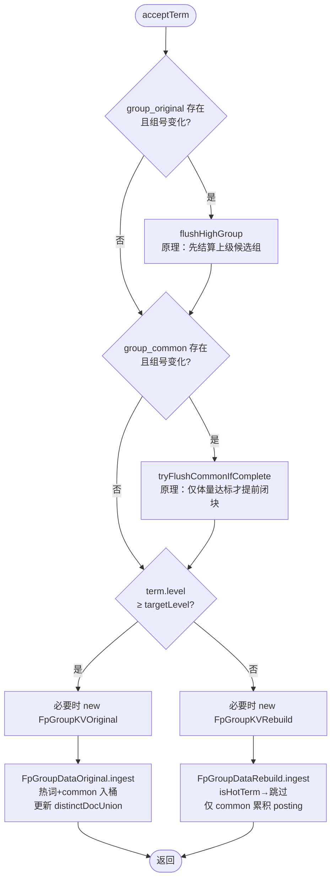

---

### 6. `flushHighGroup`：透传 vs 降级

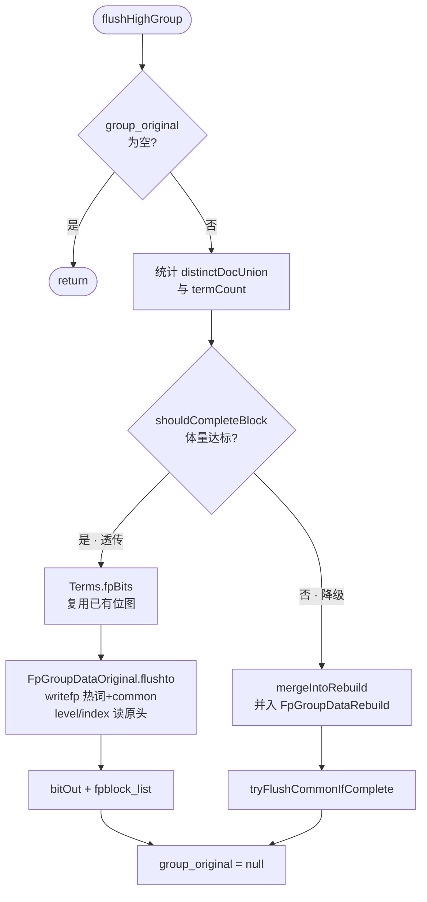

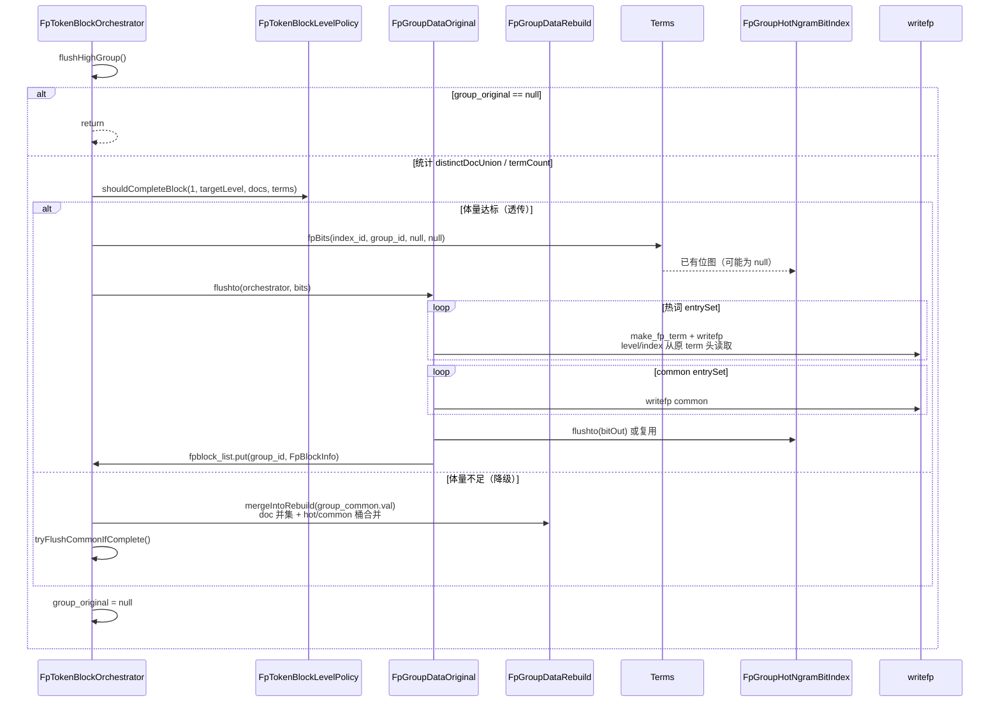

---

### 7. `flushCommonGroup` → `FpGroupDataRebuild.flushto`

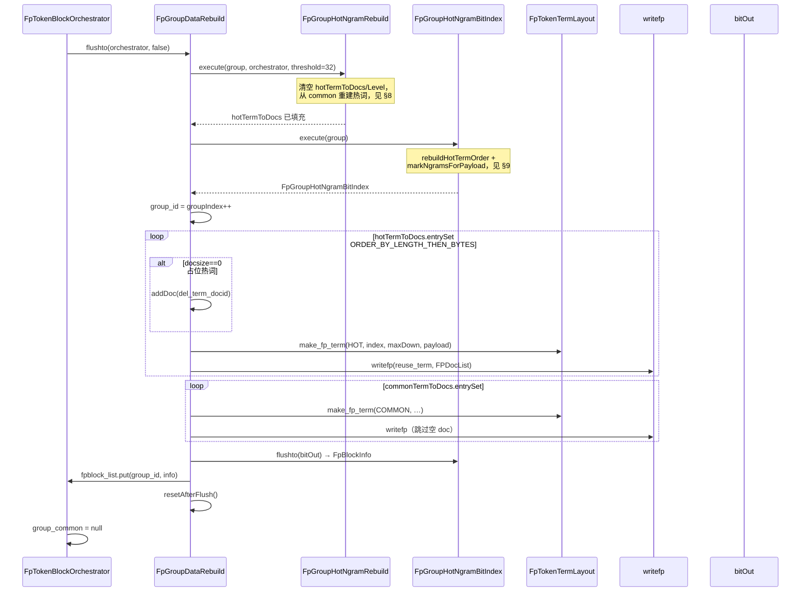

---

### 8. `FpGroupHotNgramRebuild.execute` 流程图

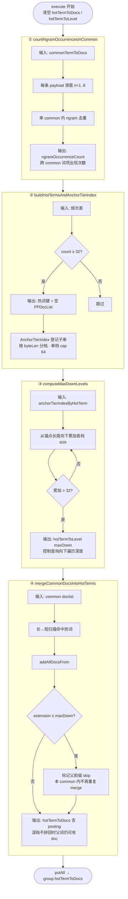

---

### 9. `FpGroupHotNgramBitIndex` 流程图

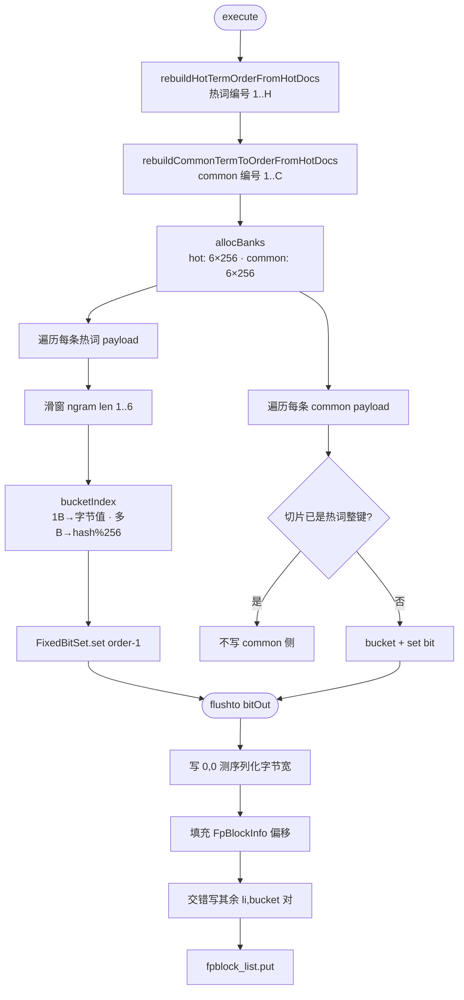

---

### 10. 运行时对象关系图（单字段写段会话）

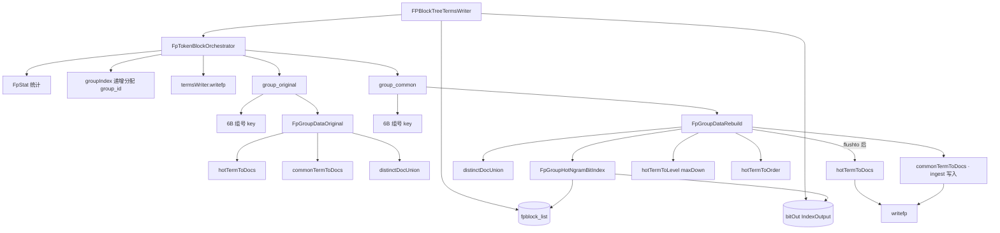

---

### 11. 双路径决策流程图

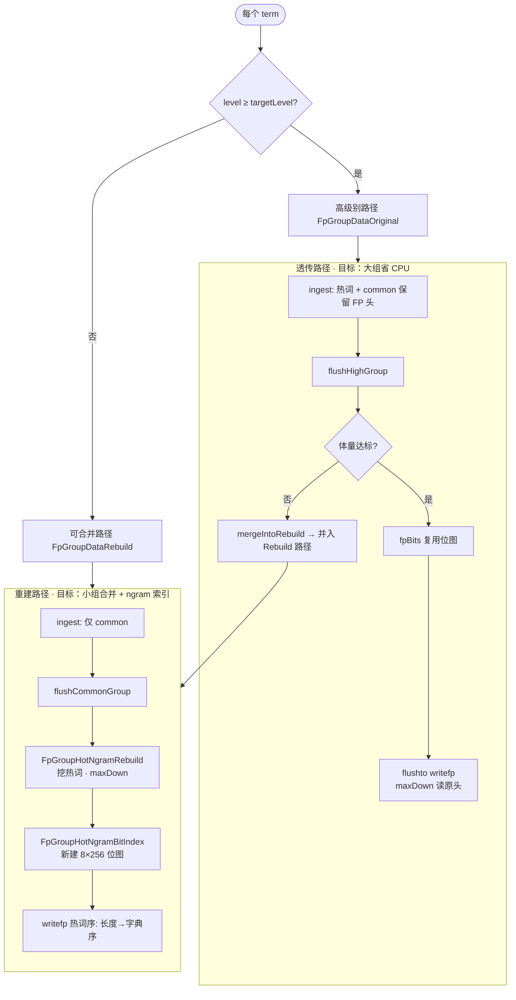

---

### 12. 检索侧流程（写段产出 → 查询消费）

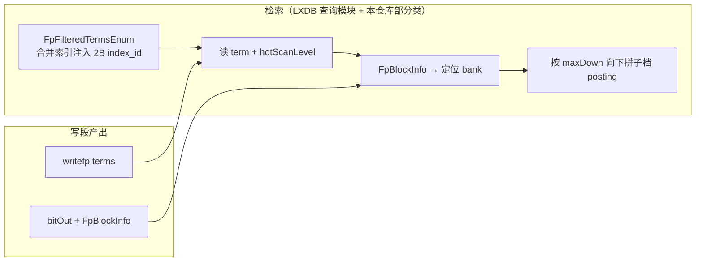

---

### 13. 单页总览（层次图）

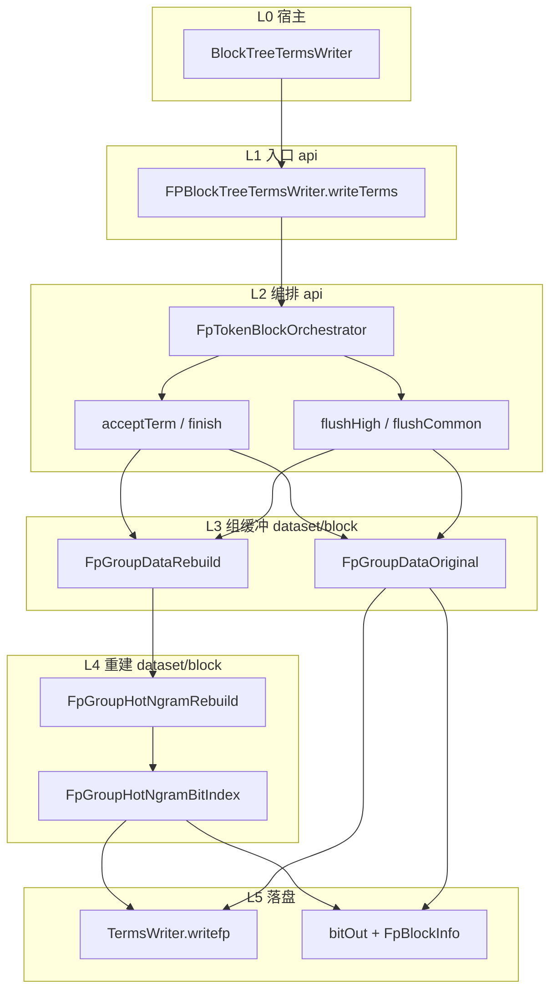

---

## 构建与测试

**推荐脚本**（仓库根目录）：

```powershell
.\scripts\run-fptoken-tests.ps1 -HtmlReport -ExcludePerfTag
```

| 场景 | 命令 |
|------|------|
| 默认单元测试（排除 `lxdb-runtime`、`performance`） | 上式或 `.\scripts\run-fptoken-tests.ps1` |
| 含依赖完整 LXDB 运行时的用例 | `.\scripts\run-fptoken-tests.ps1 -IncludeLxdbRuntimeTag`（须在完整 classpath 下） |
| 已用 IDE 与 LXDB 全量编译 | `.\scripts\run-fptoken-tests.ps1 -SkipCompile` |

**报告目录**（可删除）：`build/test-results/junit-html/index.html`

**编译说明**：

1. 运行 classpath：`bin` → `bin-test` → `lib/*.jar`。
2. 默认尝试编译全部 `src/cn`（需完整 `lib/`）。
3. 若失败，回退编译子集（`token/` 部分类 + `dataset/common` 等）；完整模块仍应在 LXDB IDE 或补齐 `lib/` 后编译。

**测试包**：`src/test/java/cn/lxdb/plugins/muqingyu/fptoken/tests/unit/`

---

## 与旧版 fptoken（互斥频繁项集 / Pre-merge hint）的关系

本仓库 **已不再包含** 旧版 `ExclusiveFpRowsProcessingApi`、采样挖掘、Pre-merge hint 等实现；相关文档若仍出现在 `docs/` 下，仅作历史参考。新模块解决的是 **Lucene 段内 FP 字段的写段编排与 n-gram 位图**，与「行级互斥项集三层输出」是不同层次的能力，可在 LXDB 产品内组合使用。

---

## 已知问题（摘要）

完整列表与测试证据见 [`docs/fp-token-review-and-test-report_20260517.html`](docs/fp-token-review-and-test-report_20260517.html)。摘要：

- **P0 / P1**：无开放项（审查中的逻辑/行为点均已按产品约定撤回，见报告 §4）。
- **P2（可选）**：块级别策略注释、Javadoc/类名一致性与集成测覆盖（BUG-201～204）。

---

## 许可与归属

模块作者见各源文件 `@author`；与 LXDB/Lucene 补丁的版权与分发策略以宿主工程为准。
