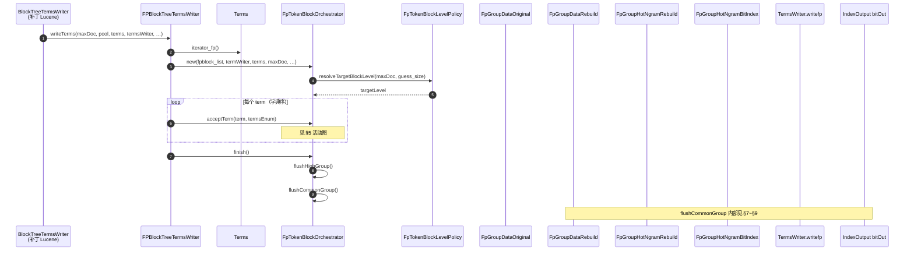
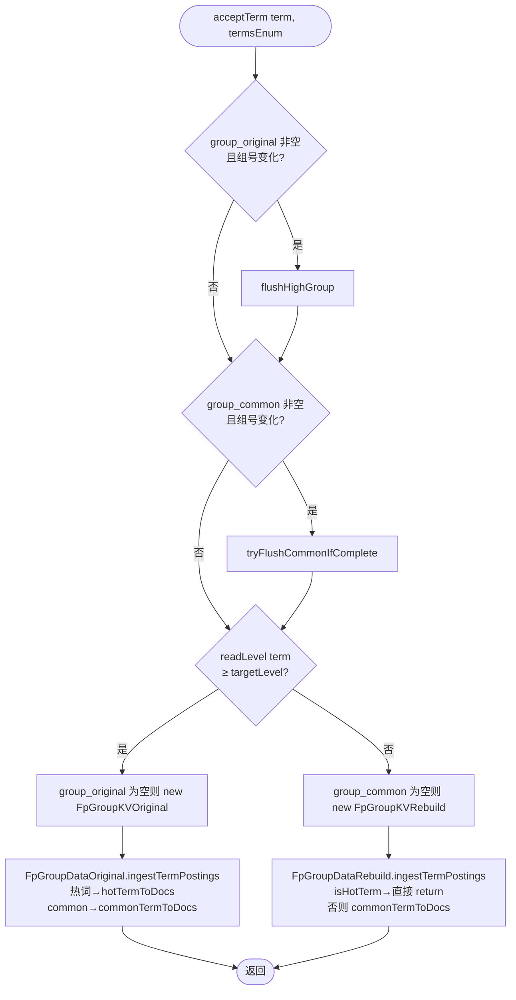
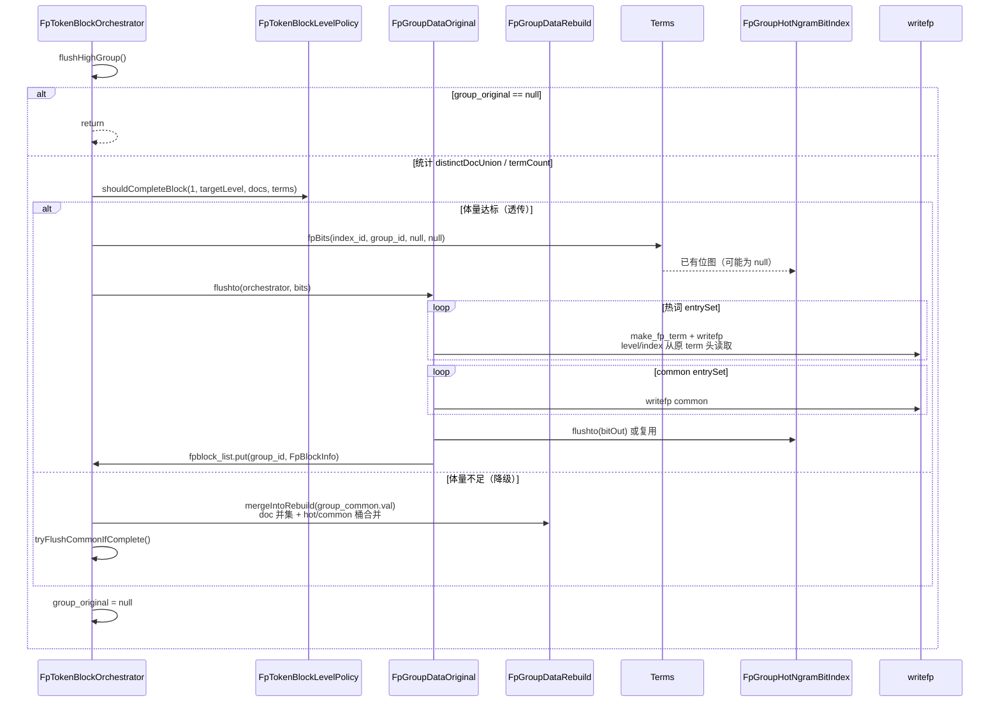
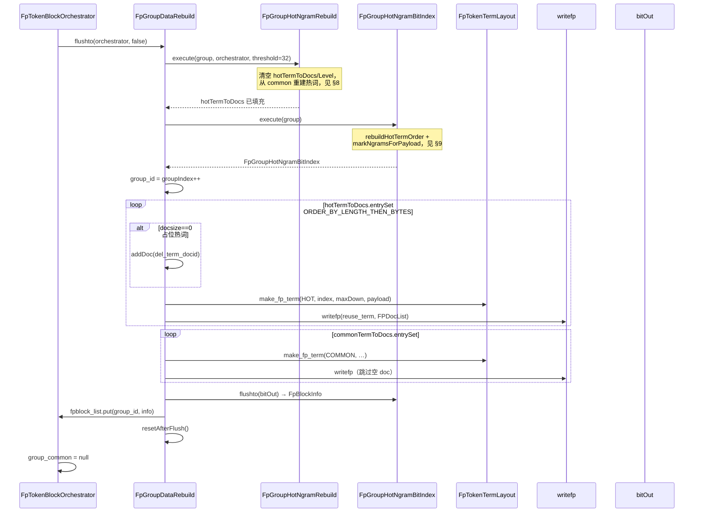
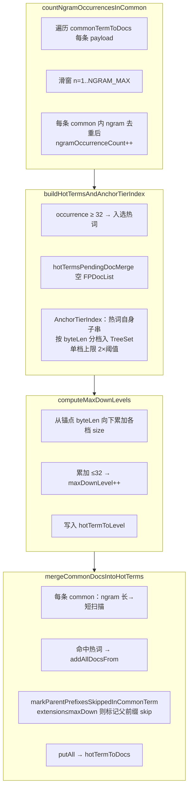
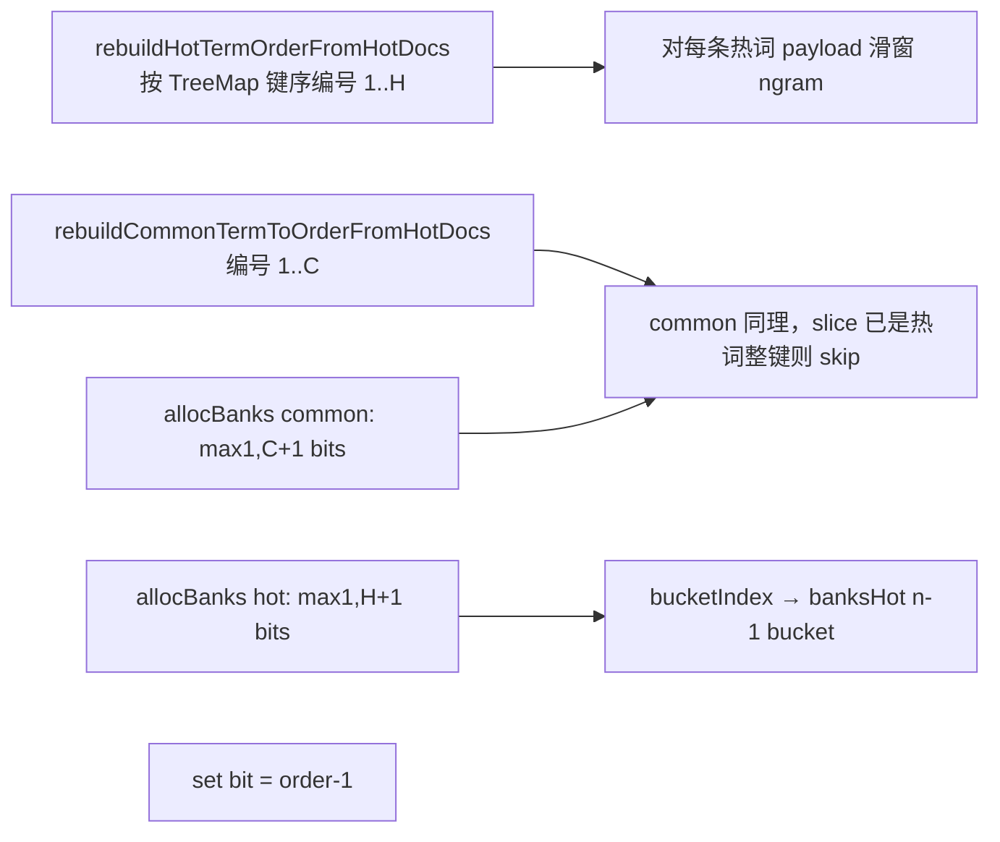
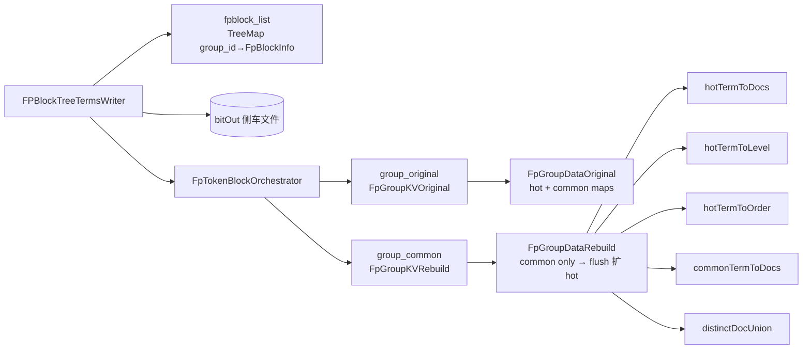
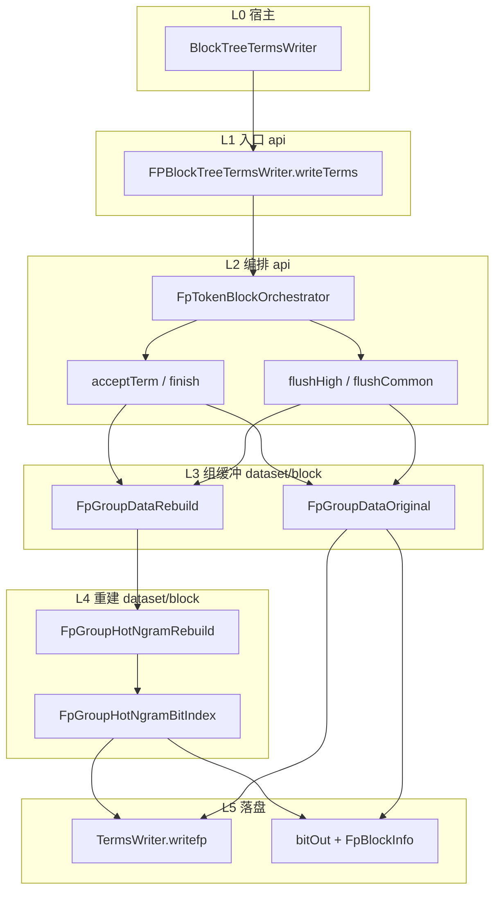

# FPToken（FP Token 模块）

面向 **LXDB / 补丁版 Lucene** 的二进制指纹（Fingerprint）索引：在 BlockTree 写段阶段按 **组（index_id + group_id）** 聚合词项，对 common 载荷做 **byte n-gram 热词挖掘** 与 **8×256 双套位图索引**，并支持高级别 term 的 **透传写出**（复用已有 `fpBits`）。

> 本仓库为 **2026-05 重写** 后的独立模块源码；须与完整 LXDB 工程（含补丁 Lucene）联编。设计说明见 [`docs/fp-token-design_20260517.html`](docs/fp-token-design_20260517.html)。

---

## 阅读导航

| 文档 | 说明 |
|------|------|
| [本 README § 写段架构与调用详解](#写段架构与调用详解入口fpblocktreetermswriter) | **从 `FPBlockTreeTermsWriter` 起的类职责表、序列图、分阶段原理** |
| [`docs/fp-token-design_20260517.html`](docs/fp-token-design_20260517.html) | 技术设计（类职责、数据流、落盘格式） |
| [`docs/fp-token-review-and-test-report_20260517.html`](docs/fp-token-review-and-test-report_20260517.html) | 代码审查 + 单元测试结果 + 潜在缺陷清单 |
| [`docs/README.md`](docs/README.md) | 历史/协作文档索引 |
| [`AGENTS.md`](AGENTS.md) | 贡献者与 Agent 速览 |

---

## 依赖

| 依赖 | 路径 / 说明 |
|------|-------------|
| **完整 `lib/`** | 与 Eclipse **`.classpath`** 对齐，约 **203** 个 JAR（`lxdb_common`、`lxdb_bigtable`、补丁 Lucene 8.9、slf4j/log4j、Tika/POI、JUnit 等）。从 LXDB 工程拷贝到 `lib/`；校验：`.\scripts\sync-lib-from-classpath.ps1` |
| **补丁 Lucene** | 由 `lib/` 提供：`Terms#iterator_fp()`、`Terms#fpBits`、`BlockTreeTermsWriter#writefp`、`TermsWriter` 等 |
| **JUnit** | `scripts/run-fptoken-tests.ps1` 可自动下载 JUnit Platform；另可自动拉取 `commons-logging-1.2.jar` |

在 **`lib/` 齐全** 时，脚本对 **全部** `src/cn` 执行 `javac` 并运行单测。若缺少补丁 JAR，脚本会回退到较小可编译子集（仅用于应急，见下文）。

---

## 包结构（`cn.lxdb.plugins.muqingyu.fptoken`）

```
token/          FPToken、FpTokenAnalyzer、BinarySlidingWindowApi（64B 窗 / 32B 步）
config/         FpTokenBlockLevelPolicy、Lucene80FPSearchConfig（字段后缀 _bfp / _sfp）
api/            FPBlockTreeTermsWriter、FpTokenBlockOrchestrator、FpFilteredTermsEnum
dataset/common/ FpTokenTermLayout、FpTermKey、FPDocList、FpBlockInfo、组 KV 容器
dataset/block/  FpGroupDataOriginal / Rebuild、FpGroupHotNgramRebuild、FpGroupHotNgramBitIndex
```

---

## 写段架构与调用详解（入口：`FPBlockTreeTermsWriter`）

本节从 **`api/FPBlockTreeTermsWriter`** 出发，说明 LXDB 补丁 Lucene 写 FP 字段时的**完整调用顺序**、**每个类的职责**与**实现原理**。字段识别：`Lucene80FPSearchConfig.isFpField(name)`（后缀 `_bfp` / `_sfp`）。更细的落盘格式见 [`docs/fp-token-design_20260517.html`](docs/fp-token-design_20260517.html)。

### 1. 与宿主 Lucene 的衔接

| 宿主组件（补丁 Lucene，不在本仓库） | 本模块组件 | 关系 |
|-----------------------------------|------------|------|
| `BlockTreeTermsWriter` 写某 FP 字段 | 构造 `FPBlockTreeTermsWriter(termWriter, bitOut)` | 共享 `bitOut`（n-gram 位图侧车文件） |
| `Terms.iterator_fp()` | `FPBlockTreeTermsWriter.writeTerms` 消费 | FP 专用字典序：同 `(index_id, group_id)` 词项相邻 |
| `BlockTreeTermsWriter$TermsWriter.writefp(...)` | `FpGroupData*.flushto` 内调用 | 写 FP 布局 term + `FPDocList` posting |
| `Terms.fpBits(index_id, group_id, …)` | `FpGroupDataOriginal.flushto` 透传路径 | 复用索引阶段已建位图，避免重建 |
| 段目录 `termsbit` 等 | `FpGroupHotNgramBitIndex.flushto(bitOut)` | 写出 `NGRAM_MAX×256` 对 hot/common `FixedBitSet` |

**段级产出**：`FPBlockTreeTermsWriter.fpblock_list`：`group_id → FpBlockInfo`（每位图区在 `bitOut` 中的偏移与宽度）。

---

### 2. 类职责总览（按包）

#### `token/` — 索引阶段产生 FP 词项字节

| 类 | 职责 | 关键 API | 写段阶段是否参与 |
|----|------|----------|------------------|
| `FpTokenAnalyzer` | FP 字段的 Lucene `Analyzer` 入口 | `createComponents` → `FPToken` | 否（索引上游） |
| `FPToken` | 对 Reader 文本做滑窗，产出带 FP 头的 `BytesRef` term | `incrementToken` | 否 |
| `FpTokenBytesMode` | 文本→字节模式（UTF-8 / 十六进制） | `fromCode` | 否 |
| `BinarySlidingWindowApi` | 64B 窗 / 32B 步的二进制滑窗工具 | `slidingWindows` | 否 |
| `WindowTerm` / `ByteRef` | 滑窗辅助类型 | — | 否 |

#### `config/` — 策略与常量

| 类 | 职责 | 关键 API | 调用方 |
|----|------|----------|--------|
| `Lucene80FPSearchConfig` | FP 字段后缀、`NGRAM_MIN/MAX`（1~6）、热词阈值 32、`BUCKETS=256` | `isFpField` | 宿主 + 全模块 |
| `FpTokenBlockLevelPolicy` | **目标块级别**与**闭块判定** | `resolveTargetBlockLevel`、`shouldCompleteBlock` | `FpTokenBlockOrchestrator` |

**`resolveTargetBlockLevel`**：`max(maxDoc, termGuess) ≥ 100_000` → `targetLevel=3`，否则 `=1`。  
**`shouldCompleteBlock(rate, level, docCnt, termCnt)`**：去重 doc 数或不同词项数**任一**达到 `level` 对应阈值（level 3 为 10 万档）即闭块。

#### `api/` — 写段与检索入口

| 类 | 职责 | 关键 API | 说明 |
|----|------|----------|------|
| **`FPBlockTreeTermsWriter`** | **本模块写段总入口**；持有 `fpblock_list`、`bitOut` | `writeTerms`、`close` | 遍历 `iterator_fp`，委托编排器 |
| **`FpTokenBlockOrchestrator`** | **组级编排**：缓冲、换组 flush、高级别/可合并分流 | `acceptTerm`、`finish`、`flushHighGroup`、`flushCommonGroup` | 内存中最多一个 `group_common` + 可选 `group_original` |
| `FpFilteredTermsEnum` | 合并索引时在 term 前 2 字节注入 `index_id` 前缀 | `next` 覆写 `BytesRef` 头 | **检索/合并**侧，不在 `writeTerms` 路径 |

#### `dataset/common/` — 布局、键、doc 列表、组容器

| 类 | 职责 | 关键 API | 说明 |
|----|------|----------|------|
| **`FpTokenTermLayout`** | **13 字节 FP 头** + payload 的布局读写 | `make_fp_term`、`readLevel`、`isHotTerm`、`readTermIndex`、`readHotTermScanLevel` | 见 §3 |
| **`FpTermKey`** | `TreeMap` 键：缓存 hash 的 `BytesRef` | `copyOf`、`viewOf`、`ORDER_BY_LENGTH_THEN_BYTES` | 热词三表统一键序 |
| **`FPDocList`** | 单 term 的 doc 列表（`int[]` → `SparseFixedBitSet`） | `addDoc`、`addAllDocsFrom`、`docsize` | ingest / merge / writefp |
| `FpBlockInfo` | 一组 n-gram 位图在 `bitOut` 中的元数据 | `writeto`/`readfrom`、`hotBankOffset` | 写入 `fpblock_list` |
| `FpGroupKVOriginal` | `(index_id, group_id)` 6 字节键 + `FpGroupDataOriginal` | `key`、`val` | 高级别候选组 |
| `FpGroupKVRebuild` | 同上 + `FpGroupDataRebuild` | `key`、`val` | 可合并组 |
| `FpStat` | 编排器段级统计 | `flush_*_cnt`、`doclist_*` | `writeTerms` 日志 |
| `FpStatNgram` | 热词重建统计 | `freqThreshold_*`、`ngram_level_*` | `FpGroupHotNgramRebuild` |
| `FpDocListEach` | （辅助） | — | 视具体用法 |

#### `dataset/block/` — 组内数据与重建

| 类 | 职责 | 关键 API | 说明 |
|----|------|----------|------|
| **`FpGroupDataRebuild`** | **可合并组**状态机：common 缓冲 → flush 时热词重建 + 写盘 | `ingestTermPostings`、`flushto`、`rebuildHotTermOrderFromHotDocs` | ingest **跳过** `isHotTerm` |
| **`FpGroupDataOriginal`** | **高级别候选组**：原样缓冲热词+common | `ingestTermPostings`、`flushto`、`mergeIntoRebuild` | 透传或降级合并 |
| **`FpGroupHotNgramRebuild`** | 从 common 挖 n-gram 热词、算 `maxDown`、merge doc | `execute` 及 4 个私有步骤 | 仅 `FpGroupDataRebuild.flushto` |
| **`FpGroupHotNgramBitIndex`** | 构建并序列化 hot/common 双套 `8×256` 位图 | `execute`、`flushto`、`readfrom` | `execute` 在 ngram 之后 |
| `AnchorTierIndex` | 热词锚点按字节长度分档的 `TreeSet` 桶 | 构造 `0..NGRAM_MAX` | `FpGroupHotNgramRebuild` 临时索引 |

---

### 3. FP 词项字节布局（`FpTokenTermLayout`）

写入 Lucene 的 term = **13 字节头** + **payload**（指纹字节序列）：

```
[offset+0..1]  index_id     (short sortable，合并时可被替换)
[offset+2..5]  group_id     (int sortable，flush 时分配新 group_id)
[offset+6]     group_level  (byte，闭块目标级别等)
[offset+7]     hot mark     (1=热词，0=common)
[offset+8..11] term_index<<1 | isDelTerm
[offset+12]    hotScanLevel (maxDown，重建路径由 FpGroupHotNgramRebuild 写入)
[offset+13..]  payload      (纯字节 n-gram 内容，无头)
```

---

### 4. 端到端调用顺序图（从 `writeTerms` 开始）



---

### 5. `acceptTerm` 详细流程（组缓冲 + 分流）

**不变量**：`iterator_fp` 保证同一 `(index_id, group_id)` 连续；编排器用 `FpTokenTermLayout.indexAndGroupEquals` 检测换组。



| 步骤 | 方法 | 原理 |
|------|------|------|
| 换组刷高级别 | `flushHighGroup` | 上一组高级别候选必须先结算，避免组号串组 |
| 换组刷 common | `tryFlushCommonIfComplete` | 仅当 `shouldCompleteBlock(3, targetLevel, doc, term)` 为真才 `flushCommonGroup`；小段不强制提前闭块 |
| 高级别 ingest | `FpGroupDataOriginal.ingestTermPostings` | `clearAndCopyGroupBytes` 保留载荷；热词/common 分桶；更新 `distinctDocUnion` |
| 可合并 ingest | `FpGroupDataRebuild.ingestTermPostings` | **热词在索引阶段已写出或将在 flush 重建**；此处只累积 common 的 posting，供 n-gram 挖掘 |

---

### 6. `flushHighGroup`：透传 vs 降级



| 路径 | 条件 | CPU 行为 | 热词 / 位图来源 |
|------|------|----------|-----------------|
| **透传** | 组内 doc 或 term 数达到 `targetLevel` 阈值 | 不重算 n-gram、不重建热词表 | 索引阶段已写入；`terms.fpBits` |
| **降级** | 未达标（如删除导致组萎缩） | 并入 `FpGroupDataRebuild`，走 §7 重建 | 与纯 common 组相同 |

---

### 7. `flushCommonGroup` → `FpGroupDataRebuild.flushto`



---

### 8. `FpGroupHotNgramRebuild.execute` 分步（原理）



| 步骤 | 输入 | 输出 | 原理 |
|------|------|------|------|
| count | `commonTermToDocs` | `HashMap<FpTermKey,Integer>` 频次 | 跨 common **词项数**统计（非 doc 频次）；单 common 内同 ngram 只计 1 |
| build | 频次表 | 热词键 + `AnchorTierIndex` | 阈值 32 与挖掘阈值一致；分档索引供 maxDown 预算 |
| compute | 分档索引 | `hotTermToLevel` | 控制查询向下拼档深度；写段 merge 用同一预算避免同 common 重复 merge |
| merge | common doclist | 热词 `FPDocList` | **不**做写段后 posting 剔除；`depth>maxDown` 时父热词仍可保留 doc（空间换时间） |

---

### 9. `FpGroupHotNgramBitIndex.execute` 分步



**`bucketIndex`**：长度 1 → 字节值 0..255；长度 2~6 → 多项式 hash 折叠到 0..255。  
**`flushto(bitOut)`**：先写 `[0][0]` hot/common 测字节宽 → 记录 `FpBlockInfo` → 交错写其余 `(lengthIdx, bucket)` 对。

---

### 10. 运行时数据结构关系（单字段写段）



---

### 11. 双路径对照（决策一览）

| 维度 | 高级别透传 `FpGroupDataOriginal` | 可合并重建 `FpGroupDataRebuild` |
|------|----------------------------------|-----------------------------------|
| **进入条件** | `term.level ≥ targetLevel` | `term.level < targetLevel` |
| **ingest** | 热词 + common，保留完整 FP 头 | 仅 common（`isHotTerm` 跳过） |
| **闭块 flush** | `flushHighGroup` | `flushCommonGroup` / 换组时 `tryFlushCommonIfComplete` |
| **热词从哪来** | 索引阶段 `FPToken` 已标热词 | `FpGroupHotNgramRebuild` 从 common 挖 |
| **maxDown** | `readHotTermScanLevel` / 原头 | `computeMaxDownLevels` |
| **位图** | `Terms.fpBits(...)` | `FpGroupHotNgramBitIndex.execute` 新建 |
| **term 写出顺序** | `TreeMap` 自然序（原始） | 热词 `ORDER_BY_LENGTH_THEN_BYTES` |
| **典型目的** | 大组原样落盘，省 CPU | 小组合并、压缩、n-gram 索引 |

---

### 12. 检索侧（与写段衔接，本仓库仅部分实现）

| 类 | 职责 |
|----|------|
| `FpFilteredTermsEnum` | 多索引合并写段时，在 term 前注入 2 字节 `index_id`，与 `FpTokenTermLayout` 头内 `index_id` 协同 |
| 补丁 `Terms` / 查询 FP 搜索 | 读 `writefp` 落盘 term + `FpBlockInfo` 定位 `bitOut` banks；按 `hotScanLevel` 向下拼子档（实现在 LXDB 查询模块） |

---

### 13. 单页总览（层次图）



---

## 构建与测试

**推荐脚本**（仓库根目录）：

```powershell
.\scripts\run-fptoken-tests.ps1 -HtmlReport -ExcludePerfTag
```

| 场景 | 命令 |
|------|------|
| 默认单元测试（排除 `lxdb-runtime`、`performance`） | 上式或 `.\scripts\run-fptoken-tests.ps1` |
| 含依赖完整 LXDB 运行时的用例 | `.\scripts\run-fptoken-tests.ps1 -IncludeLxdbRuntimeTag`（须在完整 classpath 下） |
| 已用 IDE 与 LXDB 全量编译 | `.\scripts\run-fptoken-tests.ps1 -SkipCompile` |

**报告目录**（可删除）：`build/test-results/junit-html/index.html`

**编译说明**：

1. 运行 classpath：`bin` → `bin-test` → `lib/*.jar`。
2. 默认尝试编译全部 `src/cn`（需完整 `lib/`）。
3. 若失败，回退编译子集（`token/` 部分类 + `dataset/common` 等）；完整模块仍应在 LXDB IDE 或补齐 `lib/` 后编译。

**测试包**：`src/test/java/cn/lxdb/plugins/muqingyu/fptoken/tests/unit/`

---

## 与旧版 fptoken（互斥频繁项集 / Pre-merge hint）的关系

本仓库 **已不再包含** 旧版 `ExclusiveFpRowsProcessingApi`、采样挖掘、Pre-merge hint 等实现；相关文档若仍出现在 `docs/` 下，仅作历史参考。新模块解决的是 **Lucene 段内 FP 字段的写段编排与 n-gram 位图**，与「行级互斥项集三层输出」是不同层次的能力，可在 LXDB 产品内组合使用。

---

## 已知问题（摘要）

完整列表与测试证据见 [`docs/fp-token-review-and-test-report_20260517.html`](docs/fp-token-review-and-test-report_20260517.html)。摘要：

- **P0 / P1**：无开放项（审查中的逻辑/行为点均已按产品约定撤回，见报告 §4）。
- **P2（可选）**：块级别策略注释、Javadoc/类名一致性与集成测覆盖（BUG-201～204）。

---

## 许可与归属

模块作者见各源文件 `@author`；与 LXDB/Lucene 补丁的版权与分发策略以宿主工程为准。
