# FPToken（FP Token 模块）

面向 **LXDB / 补丁版 Lucene** 的二进制指纹（Fingerprint）索引：在 BlockTree 写段阶段按 **列名 + 组（column + index_id + group_id）** 聚合词项，对 common 载荷做 **byte n-gram 热词挖掘** 与 **v3 sorted bucket 倒排索引**（hot/common 双 tier + skip 跳跃读），并支持高级别 term 的 **透传写出**（复用已有 `fpBits`）。

每个倒排词项在 **`FpTokenTermLayout`** 最前携带 **可变长 JSON 列名**（`4B 长度 + UTF-8 字段 key`），使同一 FP 字段下可索引 **海量稀疏列**（例如百万级 JSON key），查询时按 **列名 + ngram 切片** 精确定位，列名 **不参与** ngram 滑窗与 bucket 统计。

> 本仓库为 **2026-05 重写** 后的独立模块源码；须与完整 LXDB 工程（含补丁 Lucene）联编。  
> **技术设计（v3）**：[docs/fp-token-design_20260517.md](docs/fp-token-design_20260517.md) · [HTML](docs/fp-token-design_20260517.html)

---

## 阅读导航

| 文档 | 说明 |
|------|------|
| [本 README § JSON 稀疏列](#json-稀疏列列名前缀) | **列名前缀布局、百万级 JSON key 检索** |
| [本 README § v3 bucket 索引](#v3-bucket-索引与查询) | **bucketIndex 规则、selective 查询、内存模型** |
| [写段详细流程图 MD](docs/fp-token-write-path-detailed.md) · [PNG](docs/fp-token-write-path-detailed.png) · [HTML](docs/fp-token-write-path-detailed.html) | 方法级写段总流程 |
| [fp-token-design_20260517.md](docs/fp-token-design_20260517.md) | 类职责、落盘格式、集成点 |
| [fp-token-write-search-alignment-report.md](docs/fp-token-write-search-alignment-report.md) | 写段与查询对齐审查 |
| [docs/index.md](docs/index.md) · [docs/README.md](docs/README.md) | 全站 HTML ↔ MD 索引 |
| [`AGENTS.md`](AGENTS.md) | 贡献者与 Agent 速览 |

---

## 依赖

| 依赖 | 路径 / 说明 |
|------|-------------|
| **完整 `lib/`** | 与 Eclipse **`.classpath`** 对齐，约 **203** 个 JAR（`lxdb_common`、`lxdb_bigtable`、补丁 Lucene 8.9、slf4j/log4j、Tika/POI、JUnit 等）。从 LXDB 工程拷贝到 `lib/`；校验：`.\scripts\sync-lib-from-classpath.ps1` |
| **补丁 Lucene** | 由 `lib/` 提供：`Terms#iterator_fp()`、`Terms#fpBits`、`BlockTreeTermsWriter#writefp`、`TermsWriter` 等 |
| **JUnit** | `scripts/run-fptoken-tests.ps1` 可自动下载 JUnit Platform；另可自动拉取 `commons-logging-1.2.jar` |

在 **`lib/` 齐全** 时，脚本对 **全部** `src/cn` 执行 `javac` 并运行单测。若缺少补丁 JAR，脚本会回退到较小可编译子集（仅用于应急，见下文）。

---

## JSON 稀疏列：列名前缀

典型场景：宽表 / JSON 文档有 **极多字段 key**（稀疏、每列文档占比低），若不为列名分区，不同列的相同字节 ngram 会混在同一倒排与位图桶中，查询无法区分「哪个 JSON 列命中」。

### 词项字节布局（`FpTokenTermLayout`）

```
| 偏移        | 长度   | 字段                 | 说明 |
|-------------|--------|----------------------|------|
| 0           | 4      | columnNameLen        | sortable int，列名 UTF-8 字节数 |
| 4           | 变长   | columnName           | JSON 字段名（如 `user.tags`） |
| 4+N         | 14     | FP 定长头            | 见下表；`headerOffset(term) = 4+N` |
| 4+N+14      | 变长   | ngram payload        | 仅指纹字节；**不含**列名 |

FP 定长头（14 字节，相对 headerOffset）：

| 头内偏移 | 长 | 字段 | 写段 / 查询 |
|----------|----|------|-------------|
| 0 | 2 | index_id | 段内索引号 |
| 2 | 4 | group_id | `fpblock_list` 键；闭块时重编号 |
| 6 | 1 | group_level | 块级别 |
| 7 | 1 | term_flag | 热词 / 普通 |
| 8 | 4 | termIndex | 组内序号；位图 bit 对应 |
| 12 | 1 | isDelTerm | 删除占位 |
| 13 | 1 | hotDownTierBudget | 热词向下扩展档预算 |

### 写段与查询如何用到列名

| 环节 | 行为 |
|------|------|
| **组边界** | `FpTokenBlockOrchestrator` 用 `column_index_group_copy` / `column_index_group_equals`：换 **列名** 或换 **index_id+group_id** 即刷组；列级 `targetLevel` 来自 `field_targetlevel`（按列统计历史 common/doc） |
| **内存 Map 键** | `FpTermKey` 存 `[列名前缀][ngram payload]`（列名与 payload 在完整 term 中由 14B 头隔开；ingest 侧为列名+载荷键） |
| **热词 / 位图** | `FpGroupHotNgramRebuild`、`FpGroupHotNgramBitIndex` 只对 **ngram payload** 滑窗；v3 为 `bucketIndex → order[]` sorted posting |
| **落盘 term** | `make_fp_term(reuse, columnName, …, ngramPayload)` 写出完整词项；`FpBlockInfo.fieldInfo` 记录列名 |
| **查询** | `FpTokenQuery(fieldName, …)` → `FpSearch.search(…, new BytesRef(fieldName), slices)`；`seekCeil` 前缀含列名，`termHeaderMatches` 校验列名后再比 payload |

列名长度 **不固定**（每列可不同），因此 term 总长可变；稀疏百万列时，倒排按 **列名字典序 + 组内序** 自然分区，查询只打开目标列对应 seek 前缀，避免全库扫描所有列的同名 ngram。

---

## v3 bucket 索引与查询

### bucketIndex（`FpGroupHotNgramBitIndex.bucketIndex`）

ngram 长度 **1~6**（`Lucene80FPSearchConfig.NGRAM_MIN/MAX`）：

| 长度 | 规则 |
|------|------|
| 1 | `b0 & 0xFF` |
| 2~4 | 大端字节直接拼成 `int`（不 hash） |
| 5~6 | `StringHelper.murmurhash3_x86_32` |

> 变更 2~4 字节规则后**须重建段**，否则写查 bucket 不一致。

### 磁盘结构（`FpBlockInfo.FORMAT_VERSION = 3`）

每组 termsbit 侧车：**hot tier** + **common tier**，各含 6 个 LenRow（按 ngram 长度）。  
每个 LenRow：`sortedKeys` + `entryMeta` + `orderArena`；每 128 条 posting 一条 skip `(anchorKey, keysPtrRel)`。

### selective 查询（`FpSearch`）

```text
selectiveKeysForSlices(slices) → bucketKeys[]
loadBitIndex → terms.fpBits(indexId, groupId, bucketKeys, bucketKeys)
  → readfromBanksSelective：skip 跳跃读盘，预取 orderList 到内存
lookupHotOrders / lookupCommonOrders → 纯内存查 sparseOrders
```

- 不在位图实例上持有 `IndexInput`。
- 不做全量 `fpBits(null,null)` 回退。
- 无 bit 索引的小组：`searchSparseNoBitIndexTerms` 从 `maxGroupId+1` seek。

### 热词阈值

`HOT_TIER_TERM_COUNT_THRESHOLD = 64`（common ngram 出现次数升格 hot）。

---

## 包结构（`cn.lxdb.plugins.muqingyu.fptoken`）

```
token/          FpToken、FpTokenAnalyzer、BinarySlidingWindowApi（64B 窗 / 32B 步）
config/         FpTokenBlockLevelPolicy、Lucene80FPSearchConfig（字段后缀 _bfp / _sfp）
api/            FPBlockTreeTermsWriter、FpTokenBlockOrchestrator、FpSearch、FpTokenQuery
dataset/common/ FpTokenTermLayout、FpTermKey、FPDocList、FpBlockInfo、组 KV 容器
dataset/block/  FpGroupDataOriginal / Rebuild、FpGroupHotNgramRebuild、FpGroupHotNgramBitIndex
```

---

## 写段总流程图（入口：`FPBlockTreeTermsWriter`）

**详细高清整图（推荐）**：[docs/fp-token-write-path-detailed.png](docs/fp-token-write-path-detailed.png)（可用 [docs/fp-token-write-path-detailed.html](docs/fp-token-write-path-detailed.html) 打开）。源图 `docs/fp-token-write-path-detailed.mmd`，重新生成：`.\scripts\render-fp-write-path-diagram.ps1`。

下面为 README 内嵌的简版 Mermaid。字段后缀 `_bfp` / `_sfp`。字节格式见 [`docs/fp-token-design_20260517.html`](docs/fp-token-design_20260517.html)。

```mermaid
flowchart TD
  subgraph P0["【阶段0】索引上游 token/ · 写段前完成"]
    P0A["FpTokenAnalyzer → FpToken<br/>文本切成指纹字节"]
    P0B["每个 term = 列名前缀 + 14B FP头 + ngram载荷<br/>列名=JSON字段key；载荷不含列名"]
    P0A --> P0B
  end

  subgraph P1["【阶段1】补丁 Lucene 调本模块"]
    P1A["BlockTreeTermsWriter 要写 FP 字段"]
    P1B["new FPBlockTreeTermsWriter<br/>绑定 bitOut 侧车 + fpblock_list"]
    P1A --> P1B
  end
  P0 --> P1

  subgraph P2["【阶段2】FPBlockTreeTermsWriter.writeTerms · 写段总入口"]
    P2A["iterator_fp 遍历全字段词项<br/>同一 列名+index_id+group_id 必须挨着"]
    P2B["new FpTokenBlockOrchestrator"]
    P2C["FpTokenBlockLevelPolicy<br/>段很大→闭块用3级，否则用1级"]
    P2A --> P2B --> P2C
  end
  P1 --> P2

  subgraph P2H["词项结构 FpTokenTermLayout"]
    direction LR
    H0["0+ 4B列名+UTF-8列名"] --> H1["+0 索引号2B"]
    H1 --> H2["组号4B"] --> H3["级别1B"]
    H3 --> H4["热/普1B"] --> H5["termIndex4B"]
    H5 --> H6["del+budget2B"] --> H7["ngram载荷"]
  end
  P2 --> P2H

  subgraph P3["【阶段3】循环 acceptTerm · 每个词项一次"]
    P3A{"换组了？"}
    P3A -->|是| P3B["flushHighGroup 先结旧的高级组"]
    P3B --> P3C{"换组且 common 组够大？"}
    P3C -->|是| P3C2["flushCommonGroup"]
    P3A -->|否| P3D
    P3C -->|否| P3D
    P3C2 --> P3D{"词项 level ≥ targetLevel？"}
    P3D -->|是| P3E["FpGroupDataOriginal.ingest<br/>热词+普通都进桶，保留原头"]
    P3D -->|否| P3F["FpGroupDataRebuild.ingest<br/>跳过热词，只攒 common 的 posting"]
    P3E --> P3G([下一个词项])
    P3F --> P3G
  end
  P2H --> P3
  P3G -->|全部读完| P4A

  subgraph P4["【阶段4】finish 刷掉最后一组"]
    P4A["flushHighGroup"]
    P4B["flushCommonGroup"]
    P4A --> P4B
  end

  subgraph P4H["flushHighGroup 分支说明"]
    PH1{"组够大？达标闭块"}
    PH1 -->|达标·透传| PH2["fpBits 复用旧位图<br/>Original.flushto 原样 writefp"]
    PH1 -->|不够·降级| PH4["mergeIntoRebuild 并进 Rebuild"]
    PH2 --> PH3["登记 FpBlockInfo"]
  end
  P4A -.-> P4H

  subgraph P5["【阶段5】flushCommon → Rebuild.flushto · 小组合并主路径"]
    P5A["FpGroupHotNgramRebuild.execute"]
    P5A1["① 统计 common 里各 ngram 在多少个 common 词中出现"]
    P5A2["② 出现≥阈值→热词；建锚点分档索引 AnchorTierIndex"]
    P5A3["③ 算 hotDownTierBudget<br/>控制查询向下拼几层，也控制写段 merge"]
    P5A4["④ 长→短把 common 的 doc 并入热词<br/>在 hotDownTierBudget 内则本 common 内不再重复 merge 父词"]
    P5A --> P5A1 --> P5A2 --> P5A3 --> P5A4

    P5B["FpGroupHotNgramBitIndex.execute"]
    P5B1["热词/common 编号；6×LenRow sorted posting"]
    P5B2["bucketIndex → order[]；common 跳过 hot 切片"]
    P5B --> P5B1 --> P5B2

    P5A4 --> P5B
    P5B2 --> P5C["writefp 热词+common"]
    P5C --> P5D["tier 写入 bitOut，FpBlockInfo 记 fpBanksHot/Common"]
    P5D --> P5E["清空组缓冲 resetAfterFlush"]
  end
  P4B --> P5A
  PH4 -.->|降级| P5A

  subgraph CLS["涉及的类（按包）"]
    direction TB
    C1["api: FPBlockTreeTermsWriter · FpTokenBlockOrchestrator"]
    C2["config: Lucene80FPSearchConfig · FpTokenBlockLevelPolicy"]
    C3["common: FpTokenTermLayout · FpTermKey · FPDocList · FpBlockInfo"]
    C4["block: FpGroupDataOriginal/Rebuild · HotNgramRebuild · HotNgramBitIndex"]
    C1 --> C2 --> C3 --> C4
  end
  P5E --> CLS

  subgraph P6["【阶段6】落盘结果"]
    O1["倒排: writefp 的 term+posting"]
    O2["bitOut: 每组 ngram 位图"]
    O3["fpblock_list: 查偏移"]
    O1 --> O2 --> O3
  end
  CLS --> P6

  subgraph P7["【阶段7】检索 LXDB 查询侧"]
    R0["FpTokenQuery：fieldName=列名"]
    R1["FpSearch：selective fpBits + 列名过滤"]
    R2["bucket → order → seek 倒排"]
    R3["多 slice AND；hotDownTierBudget 比 payload"]
    R0 --> R1 --> R2 --> R3
  end
  P6 --> P7
```



**怎么读这张图（从上到下）**

- **阶段0~1**：索引为每个 JSON 列写出 **列名前缀 + FP 头 + ngram 载荷**；Lucene 写段时创建 `FPBlockTreeTermsWriter`。
- **阶段2**：`writeTerms` 里创建编排器；按列维护 `field_targetlevel`（闭块阈值）。
- **阶段3**：每个词项 `acceptTerm`——换 **列** 或换 **列+组** 先刷旧缓冲；高级别词进 `FpGroupDataOriginal`，低级词攒 common posting。
- **阶段4~flushHigh**：大组够大就**透传**（复用 `fpBits`）；不够**降级**进重建。
- **阶段5**：在 **单列组内** 从 common 挖热词、写 `hotDownTierBudget`、建 v3 bucket 索引、**writefp**。
- **阶段6~7**：倒排 + termsbit + `fpblock_list`；`FpTokenQuery` selective 读 order 再 seek 倒排。

更细的列名字节 API 见源码 [`FpTokenTermLayout.java`](src/cn/lxdb/plugins/muqingyu/fptoken/dataset/common/FpTokenTermLayout.java)（`readColumnName`、`make_fp_term`、`make_fp_search_prefix`、`column_index_group_*`）。

---

## 构建与测试

**推荐脚本**（仓库根目录）：

```powershell
.\scripts\run-fptoken-tests.ps1 -HtmlReport -ExcludePerfTag
```

| 场景 | 命令 |
|------|------|
| 默认单元测试（排除 `lxdb-runtime`、`performance`） | 上式或 `.\scripts\run-fptoken-tests.ps1` |
| 含依赖完整 LXDB 运行时的用例 | `.\scripts\run-fptoken-tests.ps1 -IncludeLxdbRuntimeTag`（须在完整 classpath 下） |
| 已用 IDE 与 LXDB 全量编译 | `.\scripts\run-fptoken-tests.ps1 -SkipCompile` |

**报告目录**（可删除）：`build/test-results/junit-html/index.html`

**编译说明**：

1. 运行 classpath：`bin` → `bin-test` → `lib/*.jar`。
2. 默认尝试编译全部 `src/cn`（需完整 `lib/`）。
3. 若失败，回退编译子集（`token/` 部分类 + `dataset/common` 等）；完整模块仍应在 LXDB IDE 或补齐 `lib/` 后编译。

**测试包**：`src/test/java/cn/lxdb/plugins/muqingyu/fptoken/tests/`（当前 **48** 项，`-ExcludePerfTag`）

---

## 与旧版 fptoken（互斥频繁项集 / Pre-merge hint）的关系

本仓库 **已不再包含** 旧版 `ExclusiveFpRowsProcessingApi`、采样挖掘、Pre-merge hint 等实现；相关文档若仍出现在 `docs/` 下，仅作历史参考。新模块解决的是 **Lucene 段内 FP 字段的写段编排与 n-gram 位图**，与「行级互斥项集三层输出」是不同层次的能力，可在 LXDB 产品内组合使用。

---

## 已知问题（摘要）

完整列表见 [docs/fp-token-review-and-test-report_20260517.md](docs/fp-token-review-and-test-report_20260517.md)。摘要：

- **P0 / P1**：无开放项。
- **已修复（2026-06）**：selective skip 偏移、selective 预取避免 `AlreadyClosedException`、2~4 字节 bucket 直拼 int。
- **P2（可选）**：集成测、Javadoc 一致性与长 query slice 策略。

---

## 许可与归属

模块作者见各源文件 `@author`；与 LXDB/Lucene 补丁的版权与分发策略以宿主工程为准。
